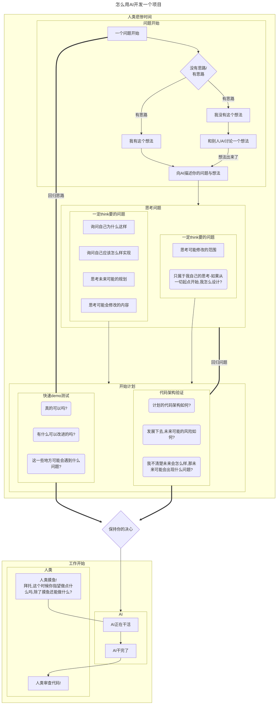

AAA

```mermaid
---
title: 怎么用AI开发一个项目
---

flowchart TD
    subgraph 人类悲惨时间
    subgraph startQ["问题开始"]
        direction BT
        start["一个问题开始"] --> think{"没有思路/\n有思路"}
        think -- "有思路" --> hasIdea["我有这个想法"] & noIdea["我没有这个想法"]
        hasIdea --> makeIdea["向AI描述你的问题与想法"]
        noIdea --> askIdea["和别人/AI讨论一个想法"]
        askIdea -- "想法出来了" --> makeIdea 
    end

    makeIdea --> askQ

    subgraph askQ["思考问题"]
        direction BT

        subgraph ask1["一定think要的问题"]
            direction RL
            askMe-how["询问自己为什么这样"]
            askMe-what["询问自己应该怎么样实现"]
            askMe-future["思考未来可能的规划"]
            askMe-change["思考可能会修改的内容"]
        end
        subgraph ask2["一定think要的问题"]
            direction RL
            askMe-size["思考可能修改的范围"]
            dp-think("只属于我自己的思考-如果从一切起点开始,我怎么设计?")
        end
    end

    ask1 --> makePlan
    ask2 --> makePlan

    subgraph makePlan["开始计划"]
        direction BT
        subgraph plan-demoTest["快速demo测试"]
            demoTest-1("真的可以吗?")
            demoTest-2("有什么可以改进的吗?")
            demoTest-3("这一些地方可能会遇到什么问题?")
        end

        subgraph plan-codeTest["代码架构验证"]
            codeTest-1("计划的代码架构如何?")
            codeTest-2("发展下去,未来可能的风险如何?")
            codeTest-3("我不清楚未来会怎么样,那未来可能会出现什么问题?")
        end
    end

    start == "回归思路" === plan-demoTest
    askQ == "回归问题" ====== plan-codeTest
    end

    plan-demoTest & plan-codeTest ==> Determination{"保持你的决心"} ---> ai

    subgraph worker["工作开始"]
        direction BT
        subgraph ai["AI"]
            direction RL
            AI-GoWork["AI正在干活"] --> AI-Fin
            AI-Fin["AI干完了"]
        end

        subgraph human["人类"]
            direction BT
            fishing["人类摸鱼!\n拜托,这个时候你指望做点什么吗,除了摸鱼还能做什么?"]
            review["人类审查代码!"]
        end

        fishing --- AI-GoWork
        AI-Fin --> review
    end
```
